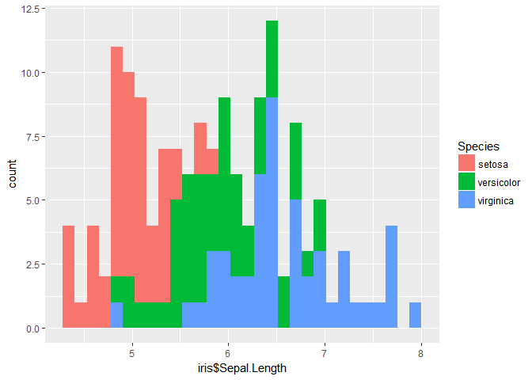
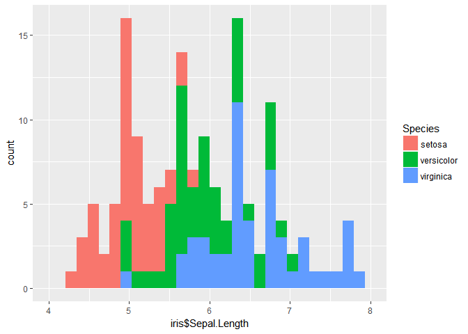
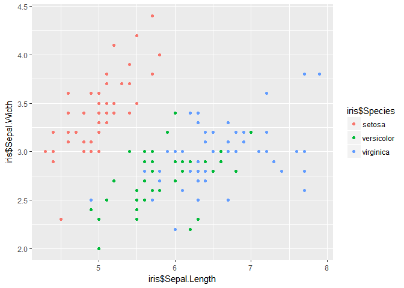

ggplot2 绘图
------------

前面几节课绘制的图形只有条形图，但是我们科研过程中需要绘制各种各样的图形来展现我们的数据，这节课就主要讲一下利用ggplot2绘制各种图形，这也是ggplot2的魔力所在。相同的数据可以通过不同类型的图形来可视化。本节课主要将绘制以下几类图形：

\*条形图

\*直方图

\*散点图

\*箱线图

\*小提琴图

\*密度图

\*点状图

\*线图

饼图

\*韦恩图

数据加载
--------

``` r
mydata<- iris

head(mydata)
```

    ##   Sepal.Length Sepal.Width Petal.Length Petal.Width Species
    ## 1          5.1         3.5          1.4         0.2  setosa
    ## 2          4.9         3.0          1.4         0.2  setosa
    ## 3          4.7         3.2          1.3         0.2  setosa
    ## 4          4.6         3.1          1.5         0.2  setosa
    ## 5          5.0         3.6          1.4         0.2  setosa
    ## 6          5.4         3.9          1.7         0.4  setosa

数据可视化
----------

### 直方图

``` r
require(ggplot2)
```

    ## Loading required package: ggplot2

``` r
p<- ggplot(iris,aes(iris$Sepal.Length,fill= Species))
p+geom_histogram()
```

    ## `stat_bin()` using `bins = 30`. Pick better value with `binwidth`.



``` r
p+geom_histogram()+ xlim(4,8)#限制x轴坐标范围
```

    ## `stat_bin()` using `bins = 30`. Pick better value with `binwidth`.



### 散点图

``` r
p1<- ggplot(iris,aes(x=iris$Sepal.Length, y=iris$Sepal.Width, colour= iris$Species))
p1 +geom_point()
```



### 箱线图

``` r
ggplot(iris,aes(iris$Species, y= iris$Sepal.Length,fill= iris$Species))+geom_boxplot()
```


